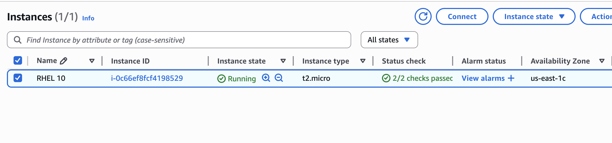
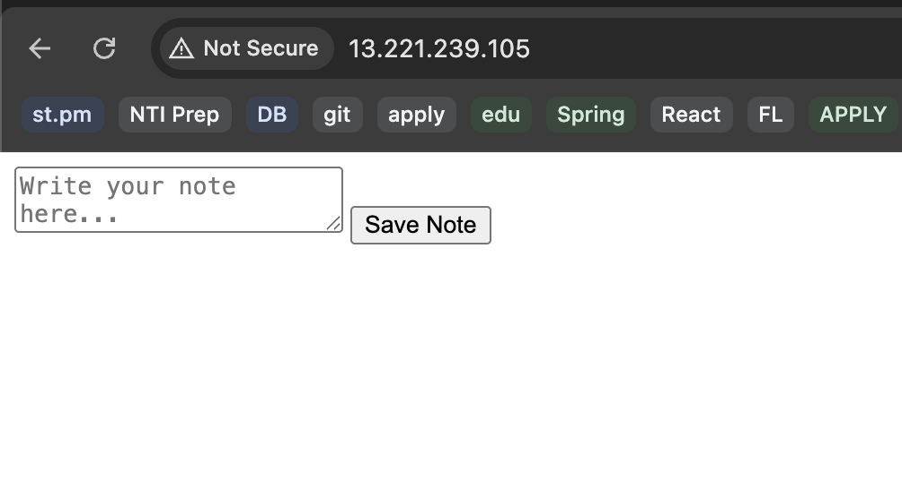
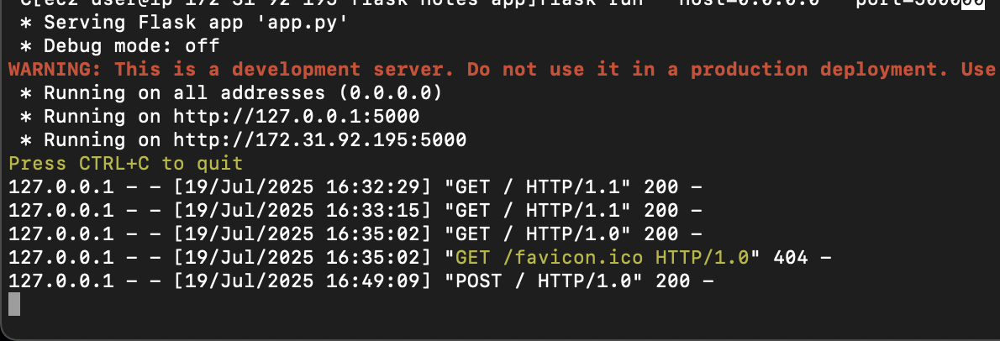
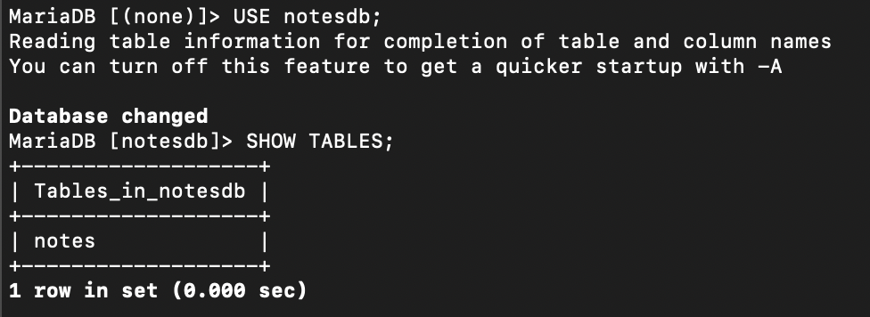
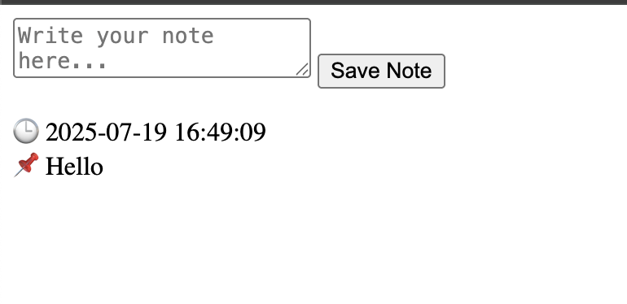
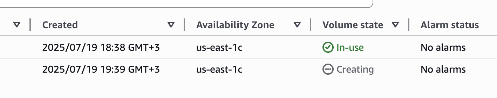
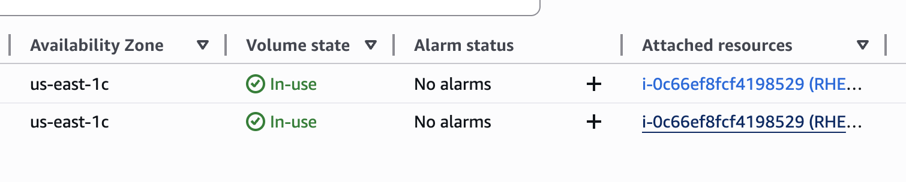
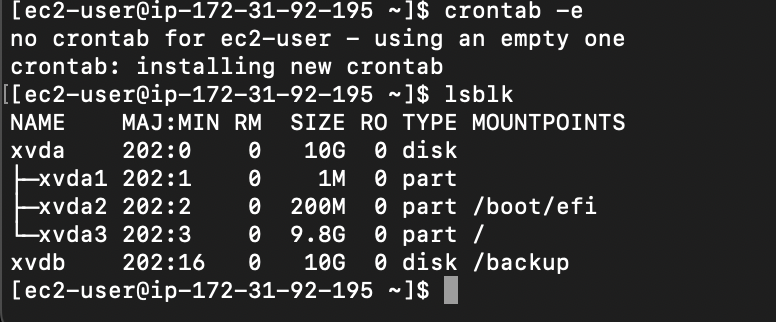
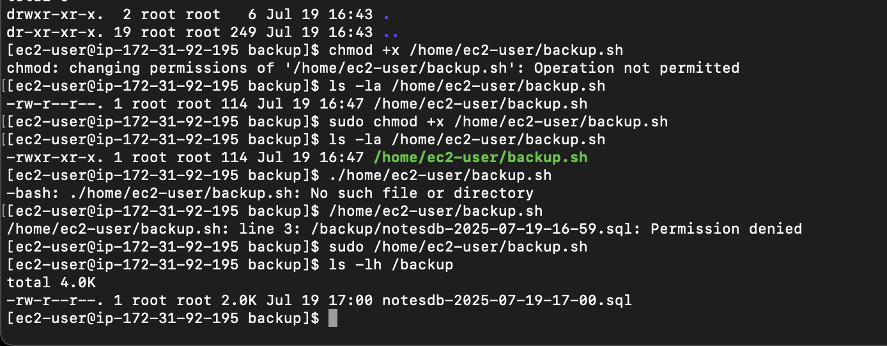

# Note Taking App With Backup

| Component    | Details                               |
| ------------ | ------------------------------------- |
| EC2 OS       | Red Hat Enterprise Linux 9 (t2.micro) |
| Language     | Python (Flask)                        |
| DBMS         | MariaDB                               |
| Web Server   | Nginx                                 |
| Backup       | Manual + Script to `/backup`          |
| Volume Mount | AWS EBS volume mounted to `/backup`   |

### Install Required Packages

```sh
sudo dnf update -y
sudo dnf install python3 python3-pip mariadb-server nginx git -y
```



### Create the App

```sh
git clone https://github.com/omerawwad/flask-notes-app.git
cd flask-notes-app
pip3 install --user flask pymysql
```





### Configure and Start MariaDB

```sh
sudo systemctl start mariadb
sudo mysql_secure_installation
```

```sql
CREATE DATABASE notesdb;
USE notesdb;

CREATE TABLE notes (
  id INT AUTO_INCREMENT PRIMARY KEY,
  note TEXT,
  timestamp DATETIME
);
```

```sql
CREATE USER 'flaskuser'@'localhost' IDENTIFIED BY 'flaskpass';
GRANT ALL PRIVILEGES ON notesdb.* TO 'flaskuser'@'localhost';
FLUSH PRIVILEGES;
```

**Shema**:

```sql
CREATE DATABASE notesdb;
USE notesdb;
CREATE TABLE notes (
  id INT AUTO_INCREMENT PRIMARY KEY,
  note TEXT,
  timestamp DATETIME
);
```



### Configuring NGINX

```nginx
server {
    listen 80;
    server_name _;

    location / {
        proxy_pass http://127.0.0.1:5000;
        proxy_set_header Host $host;
        proxy_set_header X-Real-IP $remote_addr;
    }
}
```



### Mount the Volume to `/backup`







### Create Backup Script

```sh
#!/bin/bash
TIMESTAMP=$(date +%F-%H-%M)
mysqldump -u flaskuser -pflaskpass notesdb > /backup/notesdb-$TIMESTAMP.sql
```

```sh
chmod +x /home/ec2-user/backup.sh
```


